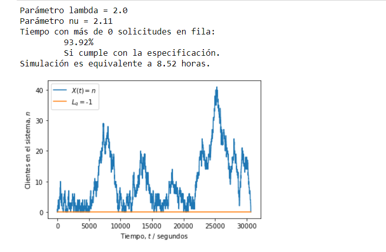

### Universidad de Costa Rica
#### IE0405 - Modelos Probabilísticos de Señales y Sistemas
#### Marcelo Abad G
#### B10001
---

#  *Cadenas de Markov*

## Sistemas M/M/1

Se modifica el codigo de cadenas de Markov para encontrar las probabilidades de transicion y permanencia de estados en la teoria de colas con los elementos en fila sujeto a la relacion de entrada y salida.
En la siguiente imagen podemos observar que con los cambios aplicados se logra con los valores dados el sistema cumpla con las especificaciones de cola.

